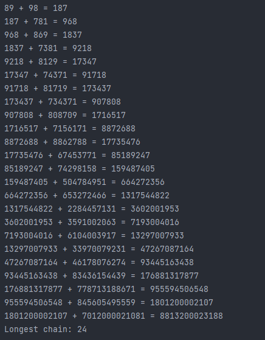

<!-- ABOUT THE PROJECT -->
## Project Description
### Question 1
- If we reverse the number 47 and add it with itself; 47 + 74 = 121, we get a palindromic number.It is not that easy to generate
  a palindromic number from each number with this procedure,  namely by reversing and adding to itself. For some numbers, we repeat this process over and over to arrive at a palindromic number. For example, for the number 349, we need to repeat this process 3 times in a chain:

```Java
    349 + 943 = 1292       | 1292 + 2921 = 4213        | 4213 + 3124 = 7337
    (not palindrome number) (not palindrome number)     (palindrome number)
```
Accordingly, write a program that finds the longest chain for which number will form from the numbers from 10 to 100 until you get a palindromic number with this procedure and print the chain to the screen. (http://www.p196.org/)


<!-- TECHNOLOGIES -->
### Technologies

<a href="https://www.java.com/" target="_blank"></a>


<!-- OUTPUT SCREENSHOTS -->
### Output Screenshots




<!-- LICENSE -->
## License

Distributed under the MIT License. See `LICENSE.txt` for more information.


<!-- CONTACT -->
## Contact

### Mehmet Akif Tanisik 

<a href="https://github.com/mehmet-akif-tanisik" target="_blank">

</a>
<a href = "mailto:matnsk@outlook.com?subject = Feedback&body = Message">

</a>
<a href="https://linkedin.com/in/mehmet-akif-tanisik" target="_blank">

</a>  
<a href="https://twitter.com/makiftanisik" target="_blank">

</a>

<!-- PROJECT-BOOTCAMP-PRACTICUM PART -->
<br />

## Java Bootcamp - Kodluyoruz & Solmaz
<div align="center">
  <a href="https://www.solmaz.com">
    
  </a>

<h3 align="center">Company: Solmaz Customs Consultancy/Brokerage Co.</h3>
</div>

<div align="center">
  <a href="https://kodluyoruz.org/tr/kodluyoruz/">
    
  </a>
<h3 align="center">Organizer: Kodluyoruz.org</h3>
</div>

