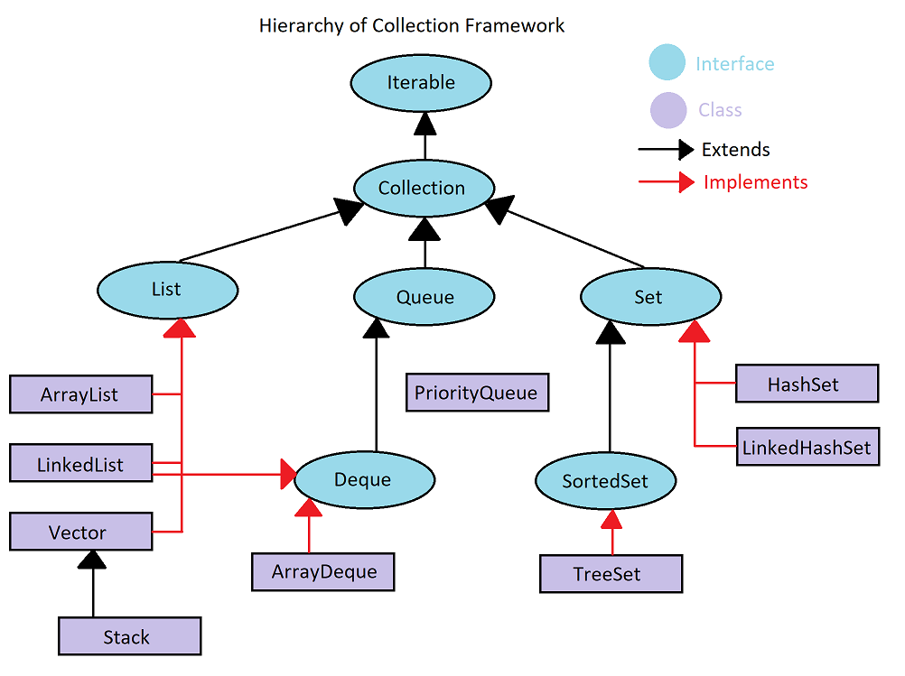

<!-- ABOUT THE PROJECT -->
## Project Description

### Question 8
Collection framework içerisindeki bütün yapıları önemli methodlarıyla örnekleyip açıklayınız.

### Answer

Collection Framework bir grup nesneyi depolamak ve işlemek için birleşik bir mimariyi temsil eder. Şunlara haip olabilir:

- Interface'ler ve onların implemantasyonları(Class)
- Algoritmalar

### Iterable Interface

Bu interface'i implemente eden sınıfların nesnelerinin 'For-each-loop' ile iterasyona uğrayabilirler.

#### Methodlar:
default void forEach(Consumer<? super T> action)
Iterator<T> iterator()
default Spliterator<T> spliterator()

### Collection Interface

Bu interface'i implemente edecek olan sınıfların ortak işlevsellikleri bu interface ile sağlanır. Altındaki 3 ayrı interfacede ise
daha karakteristik özellikler birbirinden ayrılıyor.

#### Methodlar:
- boolean	add(E e) -- Koleksiyona E tipinde bir nesne ekler.
- boolean	addAll(Collection<? extends E> c) -- Koleksiyona başka bir koleksiyondaki nesnelerini ekler.
- void	clear() -- Koleksiyondan tüm elementleri siler
- boolean	contains(Object o) -- herhangi bir nesnenin koleksiyonda olup olmadığını kontrol eder
- boolean	containsAll(Collection<?> c) -- Bir koleksiyondaki tüm elementlerin başka bir koleksiyonda olup olmadığını kontrol eder.
- boolean	equals(Object o) -- İki koleksiyonun eşitlik durumunu kontrol eder.
- int	hashCode() -- Koleksiyonun hashCode'unu döner
- boolean	isEmpty() -- Koleksiyonun boş olup olmama durumunu kontrol eder.
- Iterator<E>	iterator() -- Koleksiyondaki nesneler üzerinde bir iterator döndürür.
- default Stream<E>	parallelStream() -- muhtemel bir paralel akış döndürür
- boolean	remove(Object o) -- koleksiyondan belirli bir elementi siler, eğer varsa
- boolean	removeAll(Collection<?> c) -- koleksiyondaki elementlerden argümandaki koleksiyondakilerle aynı olanları siler.
- default boolean	removeIf(Predicate<? super E> filter) -- Bu koleksiyonun verilen yüklemi karşılayan tüm öğelerini kaldırır.
- boolean	retainAll(Collection<?> c) -- Bu koleksiyondaki yalnızca belirtilen koleksiyonda bulunan öğeleri tutar
- int	size() -- Bu koleksiyondaki öğelerin sayısını döndürür.
- default Spliterator<E>	spliterator() -- Bu koleksiyondaki öğeler üzerinde bir Ayırıcı oluşturur.
- default Stream<E>	stream() -- Kaynağı olarak bu koleksiyonla sıralı bir Akış döndürür.
- Object[]	toArray() -- Bu koleksiyondaki tüm öğeleri içeren bir dizi döndürür.
- <T> T[]	toArray(T[] a) -- Bu koleksiyondaki tüm öğeleri içeren bir dizi döndürür; döndürülen dizinin çalışma zamanı türü, belirtilen dizininkidir.

### List Interface

#### Methodlar:
- boolean	add(E e) -- listenin sonuna eleman ekler
- void	add(int index, E element) -- listenin belirli bir indexine eleman ekler
- E	get(int index) -- listenin index'indeki elemanı döner
- int	indexOf(Object o) -- eğer varsa elemanın ilk göründüğü indexi verir
- default void	sort(Comparator<? super E> c) -- listeyi sıralar
- List<E>	subList(int fromIndex, int toIndex) -- belirli aralıkta orjinal listenin kopyasını döndürür

### Queue Interface

#### Methodlar:
- boolean	add(E e) -- element ekler
- E	element() -- Bu kuyruğun başını alır, ancak kaldırmaz.
- boolean	offer(E e) -- Kapasite kısıtlamalarını ihlal etmeden hemen yapmak mümkünse, belirtilen öğeyi bu kuyruğa ekler.
- E	peek() -- Bu kuyruğun başını alır, ancak kaldırmaz veya bu sıra boşsa null değerini döndürür.
- E	poll() -- Bu kuyruğun başını alır ve kaldırır veya bu sıra boşsa null değerini döndürür.
- E	remove() -- Bu kuyruğun başını alır ve kaldırır.

### Set Interface

Koleksiyon interfaceindeki tüm methodlara sahiptir.

### Deque Interface:

#### Bazı Methodlar:
- E	getFirst() -- Bu deque'nin ilk öğesini alır, ancak kaldırmaz.
- E	getLast() -- Bu deque'nin son öğesini alır, ancak kaldırmaz.
- boolean	offerFirst(E e) -- Kapasite kısıtlamalarını ihlal etmedikçe belirtilen öğeyi bu deque'in önüne ekler.
- boolean	offerLast(E e) -- Kapasite kısıtlamalarını ihlal etmedikçe belirtilen öğeyi bu deque'in sonuna ekler.
- E	pop() -- Bu deque tarafından temsil edilen yığından bir öğe çıkarır.

<!-- TECHNOLOGIES -->
### Technologies

<!-- LICENSE -->
## License

Distributed under the MIT License. See `LICENSE.txt` for more information.

<!-- CONTACT -->
## Contact

### Mehmet Akif Tanisik

  

<!-- PROJECT-BOOTCAMP-PRACTICUM PART -->
 

## Java Bootcamp - Kodluyoruz & Solmaz

  

<h3 align="center">Company: Solmaz Customs Consultancy/Brokerage Co.</h3>

  
<h3 align="center">Organizer: Kodluyoruz.org</h3>

